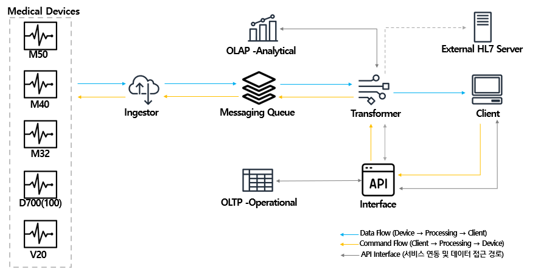
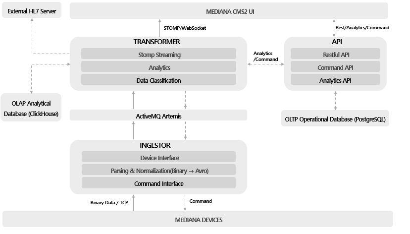

# MEDIANA CMS2 – Architecture Overview

본 문서는 CMS2 시스템의 전체 아키텍처와 데이터 흐름을 정리한 개요 문서입니다.  
이 문서는 의료 데이터의 실시간 처리, 메시징 기반 분산 구조, OLAP/OLTP 이원화 저장 방식 등 핵심 설계를 설명합니다.

---

# 1. High-Level Architecture

아래 그림은 CMS2의 전체 구성요소를 나타냅니다.

> (여기에 이미지 삽입)  
예:  


CMS2는 다음 5개의 주요 컴포넌트로 구성됩니다:

1. **Ingestor**
   - Netty 기반 TCP 서버
   - 의료장비에서 RAW 패킷 수신
   - 바이너리 파싱 → Avro 포맷 변환 → MQ 발행

2. **ActiveMQ Artemis**
   - 장비 데이터의 비동기 메시징 처리
   - 장비별 Topic 분리 (ECG, Vital, Alarm 등)
   - Back-pressure 완화 / 장애 격리

3. **Transformer**
   - Avro → Domain Model 역직렬화
   - Aggregation, Normalization
   - OLTP/OLAP 저장 구조 분리
   - 실시간 알람/상태 관리

4. **API Server**
   - 환자 정보, 장비 정보, Trend 조회 제공
   - OLAP 기반 Trend 분석 API
   - WebSocket 기반 스트리밍 게이트웨이

5. **Client (Web UI)**
   - 실시간 ECG 렌더링 (250Hz / 4ms 간격)
   - Vital/Alarm 실시간 업데이트
   - Historical Trend 조회

---

# 2. Data Flow Overview

아래는 CMS2의 데이터 흐름 구조입니다.

> (여기에 이미지 삽입)  
예:  


---

## 2.1 장비 → 서버 흐름

1. 장비에서 RAW ECG / SPO2 / Vital 패킷 전송  
2. Ingestor가 Netty로 패킷 수신  
3. 패킷 → Domain Model 파싱  
4. MQ Topic으로 메시지 발행  
5. Transformer가 메시지 Consume  
6. OLTP/OLAP 저장  
7. Client로 실시간 push

---

# 3. Component Responsibilities

---

## 3.1 Ingestor
- TCP 연결 관리
- ByteBuffer 기반 바이너리 파싱
- 장비별 패킷 구조 분리
- Avro 엔벨로프 생성 후 MQ Publish

문서:
- [Ingestor Design](./docs/ingestor.md)

---

## 3.2 Message Queue (Artemis)
- 비동기 메시징
- 소비자 장애와 장비 데이터 분리
- 메시지 누락 방지
- 장비별 우선순위 설정 가능

---

## 3.3 Transformer
- 메시지 역직렬화
- Validation / Normalization
- Aggregated Trend 생성
- OLAP 저장 파이프라인 처리

---

## 3.4 API Server
- 환자/장비 관리 API
- Trend Query API
- WebSocket 실시간 데이터 Push

---

---

# 4. Storage Design (OLAP / OLTP)

## 4.1 OLTP (PostgreSQL)
- 환자/장비/계정/설정 저장

---

## 4.2 OLAP (ClickHouse / Vector Index)

ECG·Vital 데이터는 대용량 시계열 형태로 누적되므로, 고성능 분석이 가능한 OLAP 스토리지를 사용합니다.

### 주요 기능
- **1초 단위 ECG Trend 저장**
- **고압축 Parquet 기반 저장 구조**
- **TTL 정책을 통한 자동 정리(On-Prem 환경 최적화)**
- **Vector Index를 활용한 ECG 패턴 유사도 검색 지원**

### Vector Index 기반 ECG 패턴 검색
CMS2는 ClickHouse의 Vector Index 기능을 활용하여,  
ECG Waveform의 Embedding 벡터를 저장하고 **유사 패턴 탐색(Nearest Neighbor Search)** 기능을 제공할 수 있습니다.

활용 목적:
- 부정맥(Ectopy) 패턴 유사 사례 검색  
- 특정 Lead(II/III)에서 나타나는 Morphology 비교  
- 환자 간 ECG 패턴 유사도 기반 클러스터링  
- Historical ECG 중 특정 형태와 가까운 구간 탐색  

저장 방식:
- Trend 데이터 1초 구간마다 Waveform → Embedding Vector 생성  
- 아래 형태로 저장:

```
patient_id
timestamp
trend_values
vector_embedding Float32[256]   -- ECG Embedding
```

Vector Index:
- HNSW (Hierarchical Navigable Small World Graph)
- Cosine Distance 기반 유사도 검색
- On-Prem 환경에서도 실행 가능하도록 최적화

### 예시 쿼리
```sql
SELECT *
FROM ecg_trend
ORDER BY cosineDistance(vector_embedding, toFloat32(array( ... ))) ASC
LIMIT 10;
```

문서:
- [Vector Search Overview](./docs/vector-search-overview.md)

---

# 5. Security Strategy

- DB 저장 시 필드 단위 암호화
- 환자 식별자 식별 불가 형태로 저장
- 전송 구간 TLS 적용
- 장비 인증 키 기반 연결 제어


---

# 8. Version
```
v1.0 – Initial architecture documentation
```

